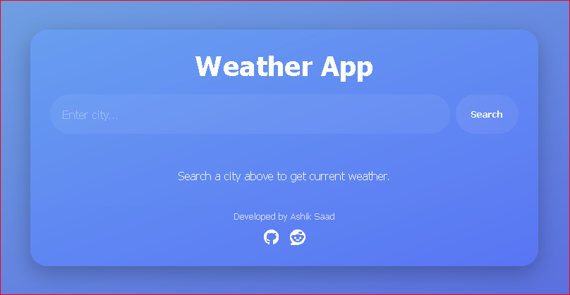

# Weather-Checker

# 🌦 Responsive Weather App

A modern, responsive **Weather App** built with **HTML, CSS, and JavaScript** that uses the [WeatherAPI](https://www.weatherapi.com/) to fetch real-time weather data.  
Designed with a clean UI/UX, includes search functionality, and works across devices.

---
[🔗Live Website: ](https://shreya-sikder.github.io/Weather-Checker/)

---
## 🚀 Features
- Search weather by **city name**
- Displays:
  - 🌡 Temperature
  - 🌤 Weather condition
  - 💧 Humidity
  - 💨 Wind speed
  - 🌡 Feels like temperature
  - 🕒 Local time
- Fully **responsive** design (mobile, tablet, desktop)
- Animated UI updates for a smooth experience
- Footer with **GitHub** and **Gmail** contact icons

---

## 📸 Preview

---

## 🛠️ Tech Stack
- **HTML5** – Structure
- **CSS3** – Styling and responsive design
- **JavaScript (ES6)** – Fetch API and DOM updates
- **Font Awesome** – Icons
- **WeatherAPI** – Weather data
